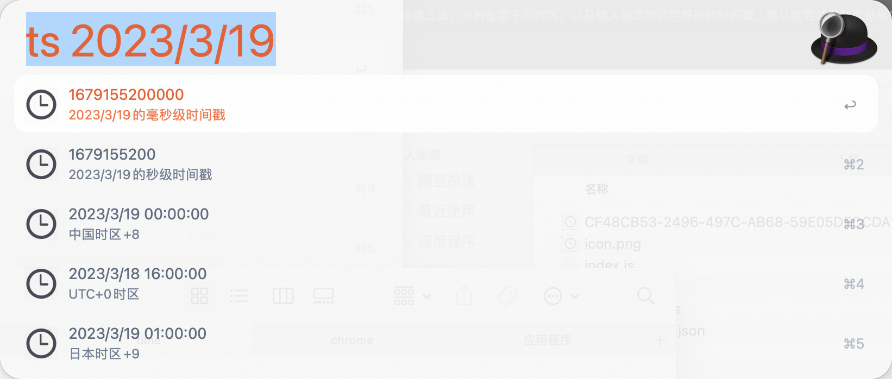

# Alfred 时间戳workflow

## 下载

## 如何使用？

### 环境变量

  - readClipboard true的话会默认尝试读取剪贴板，剪贴板如果是合法字符串或者数字会展示相应内容
  - timeZone 配置显示时间戳及日期会转换成的时区 
  - alwaysShowTimestamp 在输入时间戳的时候不显示时间戳内容

### 使用

- 输入```ts 1531139234```,单位是s,即可展示该时间戳对应的timeZone列表中的各时区的时间
- 输入```ts 1531139234000```单位是毫秒，即可展示该时间戳对应的timeZone列表中各时区的时间
- 输入```ts now```，即可展示当前时间的时间戳及timeZone列表中各时区的时间
- 输入```ts 2018/06/06 12:44```,即可展示该时间对应的时间戳及timeZone列表中各时区的时间


## 截图

